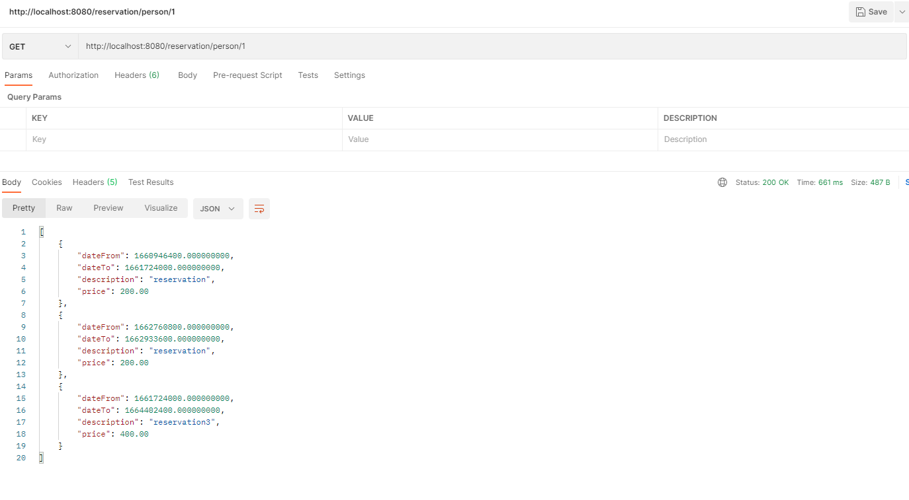

### Compile
` mvn clean compile`

or run `script.bat`

### Run
`java -jar /target/app.jar`

### Reports
a)

b)

### How to test
* Go to `http://localhost:8080/swagger-ui/#/reservation-controller/` and try out specific endpoint
* Use `curl`

``curl -X POST "http://localhost:8080/reservation/" -H "accept: */*" -H "Content-Type: application/json" -d "{\"dateFrom\":\"2022-08-29T23:47:52.562Z\",\"dateTo\":\"2022-08-29T23:47:52.562Z\",\"description\":\"string\",\"personId\":1,\"price\":0,\"rentObjectId\":1}"``
* Use Postman 
* 